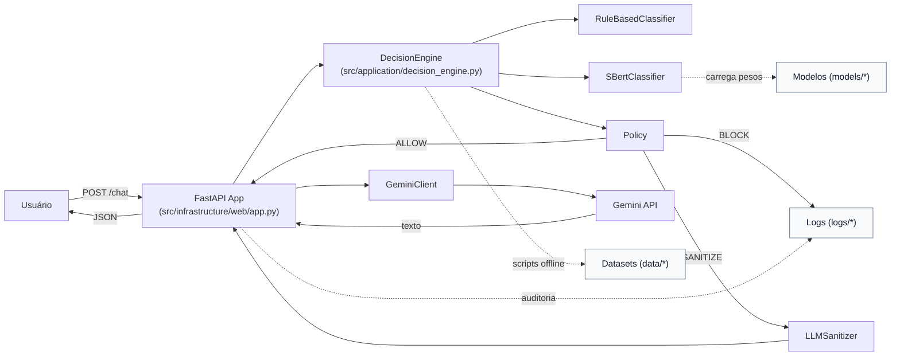

### Fluxo (Visão Geral)

```mermaid
  flowchart LR
    user["Usuário"]
    api["FastAPI App\n(src/infrastructure/web/app.py)"]
    eng["DecisionEngine\n(src/application/decision_engine.py)"]
    rb["RuleBasedClassifier"]
    sbert["SBertClassifier"]
    pol["Policy"]
    san["LLMSanitizer"]
    gemcli["GeminiClient"]
    gem["Gemini API"]

    data["Datasets (data/*)"]
    models["Modelos (models/*)"]
    logs["Logs (logs/*)"]

    classDef store fill:#f8fafc,stroke:#64748b,color:#0f172a;
    class data,models,logs store;

    user -->|"POST /chat"| api
    api --> eng
    eng --> rb
    eng --> sbert
    eng --> pol
    pol -->|ALLOW| api
    pol -->|BLOCK| logs
    pol -->|SANITIZE| san
    san --> api
    api --> gemcli
    gemcli --> gem
    gem -->|"texto"| api
    api -->|"JSON"| user

    sbert -.->|"carrega pesos"| models
    eng -.->|"scripts offline"| data
    api -.->|"auditoria"| logs
```
